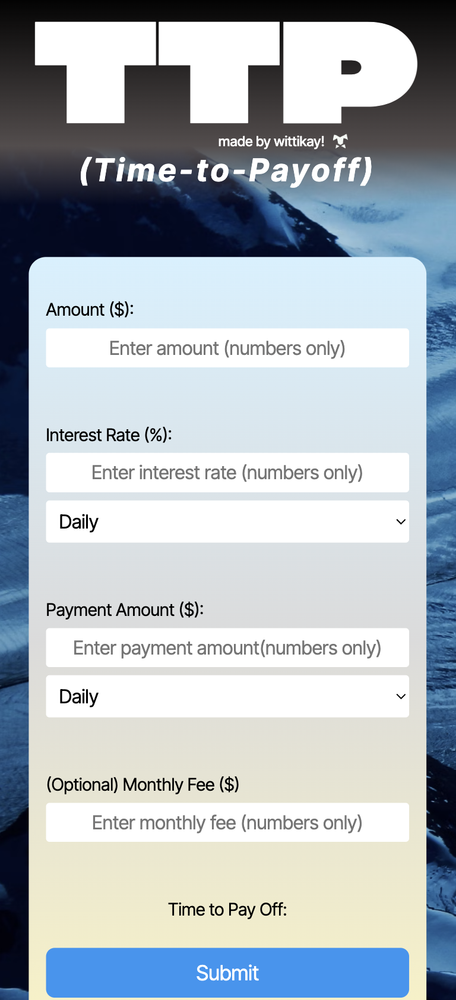

# Time to Payoff (TTP) Version 1.2

## Created by Karl (wittikay) Wilson

### Change Notes:
- Added daily payment and daily interest options. Payments and interest are compounded depending on their selection of daily or monthly frequencies. Styling applied to both new features.
#### Previous Change Notes:
- Allow for floating point numbers in interest input field.
- Adjusted JS script to include robust validation.
- Implemented responsive design for desktop and mobile use.
- Significantly overhauled UI.
- Ensured max compatibility when implementing gradient CSS (IE6+).
- Added optional monthly fee function with corresponding input checks and return messages.
- Check for zero or negative monthly payment added.
- Moved modular js files to appropriately named folders.
- Created universal styling class for header text and removed duplicate declarations.
- Updated .ico image
- Added styling and header portions. Settled on "Climate Crisis" for the application's main logo font (TTP). Used flexbox positioning for header styling and CSS gradient for background. Utilized line-spacing and other CSS styling techniques to achieve a unique implementation of the font.

#### Features:

- Returns a value in days, months, or years until payoff based off of the inputted balance, interest rate, and payment. Payments can be made to be daily or monthly. Interest can be compounded daily or monthly.

Desktop view:

Mobile View:

