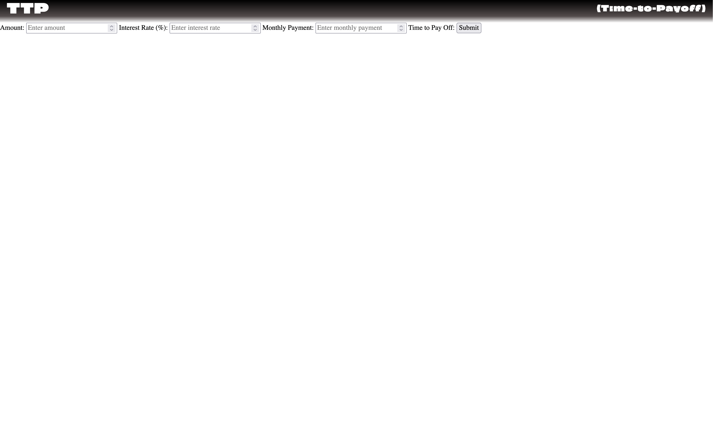

# Time to Payoff (TTP) Version 1.2

## Created by Karl (wittikay) Wilson

### Change Notes:

- Added optional monthly fee function with corresponding input checks and return messages.
- Check for zero or negative monthly payment added.
- Moved modular js files to appropriately named folders.

#### Previous Change Notes:

- Created universal styling class for header text and removed duplicate declarations.

- Updated .ico image

- Added styling and header portions. Settled on "Climate Crisis" for the application's main logo font (TTP). Used flexbox positioning for header styling and CSS gradient for background. Utilized line-spacing and other CSS styling techniques to achieve a unique implementation of the font.

#### Features:

- Inputs for balance, interest rate, and monthly payment.
- Submit button that returns the payoff time in days, months, or years respectfully.

Desktop view:

Mobile View:

